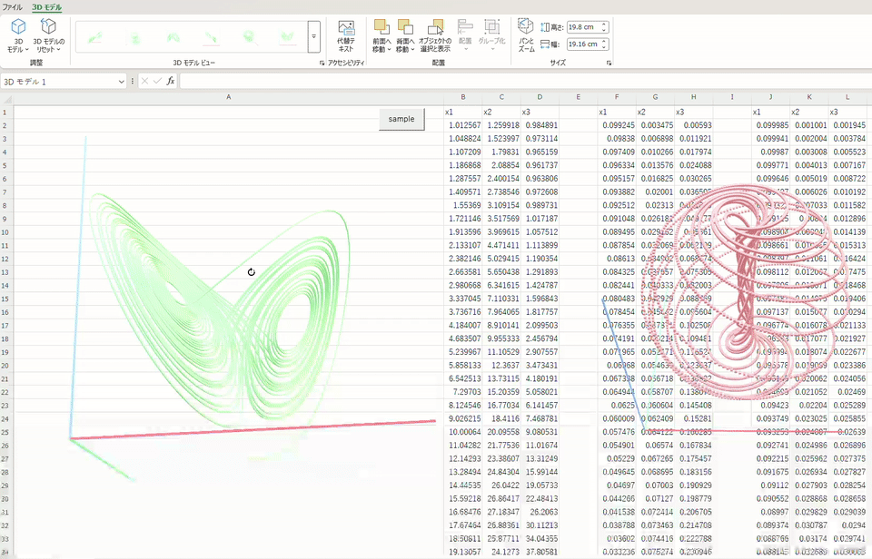

# 🧊 GLBChart
 A thing that creates something resembling a 3D chart in GLB format from Excel VBA.
 


 ## 🧊 Overview
 GLBChart is an Excel VBA class that converts numerical data from an Excel cell range into a 3D model in **GLB (glTF Binary)** format and inserts the generated 3D model directly into an Excel worksheet.

 ## 🧊 Features

 - No external 3D libraries required
- Converts XYZ numerical data from Excel into a 3D model
- Generates self-contained GLB files
- Inserts generated GLB models directly into Excel
- Customizable marker and line colors
- Displays data points connected by thin rectangular prisms
- Generates X, Y, and Z axes as rectangular prisms
- Generates a transparent floor on the XY plane
- Almost everything is a rectangular prism
- Almost everything is VBA

 ## 🧊 Requirements

 An Excel environment that supports `Shapes.Add3DModel` is required.

 ## 🧊 Installation

 Import `GLBChartBuilder` into your VBA project and you're done.

 The expected input format is shown below.

 The first row encountered that contains non-numeric values is treated as the axis labels.

 | Temperature | Pressure | Altitude |
| --- | --- | --- |
| 20 | 101 | 10 |
| 25 | 98 | 20 |
| 30 | 95 | 30 |

 **Axis labels**

 - X = Temperature
- Y = Pressure
- Z = Altitude

 In the current implementation, these labels are used internally for the chart definition.

 ## 🧊 Basic Usage

```
Public Sub sample1()
    With New GLBChartBuilder
        .HasLine = True
        .HasMarker = False
        .LineWidth = 5
        .LineColor = RGB(50, 150, 50)
        With .CreateFromRange(ActiveSheet.Range("B1:D5000"))
            .Left = 30
            .Top = 25
            .width = 250
            .Height = 250
        End With
    End With
End Sub
```

 This generates a 3D model from the specified range.

 The return value is an Excel `Shape` object.

 There are also several properties for customizing the appearance.

 ### 🧊 Markers

```
- HasMarker = True / False
- MarkerSize = ~1000
- MarkerColor = RGB(0~255, 0~255, 0~255)
```

 Data points are represented as small cubes (rectangular prisms).

 ### 🧊 Lines

```
- HasLine = True / False
- LineWidth = ~1000
- LineColor = RGB(0~255, 0~255, 0~255)
```

 When enabled, consecutive data points are connected by rectangular prisms with a rectangular cross-section.

 **Yep, they're rectangular prisms again. Rectangular prisms solve everything.**

 ## 🧊 Specification

 The generated model contains:

```
- Data points
- Connecting lines
- X axis
- Y axis
- Z axis
- Semi-transparent floor
```

 The input data is normalized and transformed to fit roughly within a 1×1×1 coordinate space.

 Therefore, the coordinates of the generated 3D model are **not** the original numerical values from the input data.

 <br> 

 **This is by design.**

 <br> 
 
 ## 🧊 How It Works

 GLBChart does not depend on any external glTF libraries.

 It builds the GLB file directly from VBA.

 The basic processing flow is:

```
Excel Range
    ↓
Vector3 data
    ↓
Geometry generation
    ↓
Binary vertex/index buffers
    ↓
glTF JSON
    ↓
GLB serialization
    ↓
Temporary .glb file
    ↓
Excel 3D Model
```

 The implementation manually generates:

```
glTF materials
buffer views
accessors
meshes
primitives
vertex buffers
index buffers
GLB header
JSON chunk
BIN chunk
```

 <br> 
 
 **VBA is amazing.**

 <br> 
 
 ## 🧊 Limitations

 GLBChart is intentionally kept small and simple.

 Current limitations include:

```
- No lighting configuration UI
- No textures
- No normals
- No animations
- No text labels inside the 3D model
- No automatic collision detection
- Large datasets can result in very large GLB files
- Markers are generated as individual geometry rather than using GPU instancing
```

 ## 🧊 License

 MIT License

 ## 🧊 Status

 **Experimental**

 GLBChart is a small experimental project for generating simple 3D visualizations directly from Excel VBA.

 ## 🧊 Disclaimer

 This project is provided **as-is**.

 Visualize at your own risk.


<details>

<summary> 🧊 日本語 </summary>

---

# 🧊GLBChart

Excel VBAからGLB形式の3Dチャートらしきものをつくるやつです


## 🧊 概要

GLBChart は、Excelのセル範囲にある数値データを GLB（glTF Binary） 形式の3Dモデルに変換し、そのままExcelのワークシートへ3Dモデルとして挿入するVBAクラスです

## 🧊 特徴
- 外部3Dライブラリ不要
- ExcelのXYZ数値データを3Dモデルへ変換
- 単一ファイルで完結するGLBを生成
- 生成したGLBをExcelへ直接挿入
- マーカー・ラインの色を変更可能
- データ点を細い直方体で接続して表示
- X・Y・Z軸も直方体で生成
- XY平面に透明な床を直方体で生成
- だいたい全部直方体
- だいたい全部VBA

## 🧊 動作環境
Shapes.Add3DModel が利用できるExcel環境が必要です

## 🧊 導入
GLBChartBuilder をインポートして完了です
想定する入力形式は以下を参照してください
最初に現れる「数値ではない行」は、軸ラベルとして扱います

|Temperature|Pressure|Altitude|
|:---:|:---:|:---:|
|20|101|10|
|25|98|20|
|30|95|30|

**軸ラベル**
- X = Temperature
- Y = Pressure
- Z = Altitude

現在の実装では、これらのラベルはチャート定義のために内部的に使用されます。

## 🧊 基本的な使い方
```vb
Public Sub sample1()
    With New GLBChartBuilder
        .HasLine = True
        .HasMarker = False
        .LineWidth = 5
        .LineColor = RGB(50, 150, 50)
        With .CreateFromRange(ActiveSheet.Range("B1:D5000"))
            .Left = 30
            .Top = 25
            .width = 250
            .Height = 250
        End With
    End With
End Sub
```

指定した範囲から3Dモデルを生成します。
戻り値はExcelの Shape オブジェクトです。

なお、外観を変更するためのプロパティがあります。

### 🧊 Markers
```
- HasMarker = True / False
- MarkerSize = ~1000
- MarkerColor = RGB(0~255,0~255,0~255)
```
データ点は小さな立方体(直方体)として表現されます。

### 🧊 Lines
```
- HasLine = True / False
- LineWidth = ~1000
- LineColor = RGB(0~255,0~255,0~255)
```
有効にすると、連続するデータ点が矩形断面の直方体で接続されます。

**やはり直方体、直方体はすべてを解決する。**


## 🧊 仕様
生成されるモデルには以下が含まれます。
```
- データ点
- 接続線
- X軸
- Y軸
- Z軸
- 半透明の床
```
入力データは正規化され、おおむね1×1×1の座標空間に収まるように変換されます。

そのため、生成された3Dモデルの座標値は、元データの数値そのものではありません。

<br>

**これは仕様です。**

<br>

## 🧊 仕組み

GLBChartは外部のGLTFライブラリに依存していません。
VBAから直接GLBファイルを組み立てます。

基本的な処理の流れは以下です。
```
Excel Range
    ↓
Vector3 data
    ↓
Geometry generation
    ↓
Binary vertex/index buffers
    ↓
glTF JSON
    ↓
GLB serialization
    ↓
Temporary .glb file
    ↓
Excel 3D Model
```


実装では以下を手動で生成します。
```
glTF materials
buffer views
accessors
meshes
primitives
vertex buffers
index buffers
GLB header
JSON chunk
BIN chunk
```

<br>

**VBAすごい**

<br>

## 🧊 制限事項

GLBChartは意図的に小さく、シンプルに作られています。

現在の主な制限事項：
```
- ライティング設定UIなし
- テクスチャなし
- 法線なし
- アニメーションなし
- 3Dモデル内への文字ラベル表示なし
- 自動衝突判定なし
- データ数が多いとGLBが巨大になる
- マーカーはGPUインスタンシングではなく個別のジオメトリとして生成
```

## 🧊 ライセンス
MIT License

## 🧊 ステータス
Experimental / 実験的

GLBChartは、Excel VBAから直接シンプルな3D可視化を生成するための、小さな実験的プロジェクトです。

## 🧊 免責事項

本プロジェクトは現状のまま提供されます。
自己責任で可視化してください。

</details>
